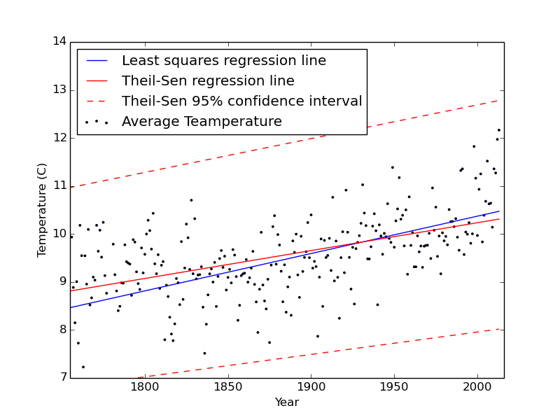

```{r setup, include=FALSE}
knitr::opts_chunk$set(echo = TRUE, 
                      warning = FALSE,
                      cache = T,
                      message = FALSE,
                      comment = '')
```
Here, the objective is to compare the speed and ease of use with either R or python to selct, tidy, and analyse medium sized datasets. The dataset that I will be using is the 'Earth Surface Temperature Data' available from [Kaggle](https://www.kaggle.com/berkeleyearth/climate-change-earth-surface-temperature-data), which combines 1.6 billion temperature reports from various datasets such as NOAA’s MLOST, NASA’s GISTEMP and the UK’s HadCrut. All temperatures are in units of $^oC$ and the dataset is roughly 533Mb.

This dataset will be used to see if there is any trend between the yearly average temperature in New York City and the year. First statistical significance between the two variables will be shown, which can be achieved using a p-value test. Following, the trend can be visualized, by plotting the two variables with a trend line determined via linear regression.

In comparing R and Python I am interested in determining the ease of use to clean, tidy and slice the data according the problem I am trying to solve. Clean and tidy data takes the form of one row per observation and one column per variable. 

## R
```{r load_r_libraries}
library(readr)
library(ggplot2)
library(tidyr)
library(dplyr)
library(lubridate)
```

```{r start_timer, echo= F}
ptm <- proc.time()
```

```{r load_data_in_r}

city_temp <- read_csv('data/GlobalLandTemperaturesByCity.csv')
city_temp_US <- city_temp %>% 
  filter(Country == 'United States' & City == 'New York') %>% 
  select(-Country, -Latitude, -Longitude, -City, -AverageTemperatureUncertainty) %>% 
  mutate(the.year = year(dt)) %>%
  group_by(the.year) %>% 
  summarise(Average.Temp = mean(AverageTemperature))
```

Now the data is clean and tidy we can perform a T-test to determine statistical significance.

```{r t_test}
t.test( city_temp_US$Average.Temp, city_temp_US$the.year)
```

The p-value is less that 0.05 so there is statistical significance between the two variables. Now we can plot the two, perfom linear refgression, and add a trend line.

```{r plot}
ggplot(data = city_temp_US, aes(x = the.year, y = Average.Temp)) + 
  geom_point(aes( color = Average.Temp))+ geom_smooth(method = lm) +
  scale_color_gradient(low = 'red', high= 'yellow') +
  ggtitle('New York City Average Yearly Temperature from 1743 to 2013')

lmfit <- lm(city_temp_US$Average.Temp ~ city_temp_US$the.year)
lmfit
```

From the plot and linear model fit we can see that there is a positive trend between the year and the average temperature in New York City. Specifically it shows that there is 0.00612$^oC/year$ increase in the temperature since 1743.

```{r stop_timer, echo = F}
proc.time() - ptm
```

The total time elapsed from the running of the code was 12.394 seconds. Where most of this time was due to the inital loading in of the data.


## Python

Now we repeat the same analysis in Python. In similar steps, the appropriate libraries are imported, the data is loaded into memory, cleaned and tidyed. Following, regression techniques are used to determine statistical significance. 

Here least squares regression is equivalent to R's linear model fit. Thiel-Sen regression is also included to obtain confidence intervals.

```{python}
from scipy import stats
import pandas as pd
import matplotlib.pyplot as plt
import time

# Start timer
start_time = time.time()

# Load in csv file
city_data_py = pd.read_csv('data/GlobalLandTemperaturesByCity.csv') 

# Filter for city equal to 'New York'
city_data_US_py = city_data_py[city_data_py['City'] == 'New York']

# Filter for country equal to 'United States' 
city_data_US_py = city_data_US_py[city_data_US_py['Country'] == 'United States']  

# Select only 'datetime' and 'AverageTemperature' columns
city_data_US_py = city_data_US_py [['dt', 'AverageTemperature']]

# Remove NaN values
city_data_US_py = city_data_US_py[city_data_US_py['AverageTemperature'].notnull()]

# Convert datetime column to a pandas datetime series object 
city_data_US_py['dt'] = pd.Series(pd.to_datetime(city_data_US_py['dt']))

# Make new column as the year of the dt column
city_data_US_py['year'] = city_data_US_py['dt'].dt.year

# Group by year and take the mean
AvgTemp_US_py = city_data_US_py.groupby('year').mean()

# Create new column of the year
AvgTemp_US_py.index.name = 'Year'
AvgTemp_US_py.reset_index(inplace=True)

# Use scipy lingress function to perform linear regression
slope, intercept, r_value, p_value, std_err = stats.linregress(AvgTemp_US_py['Year'], \
    AvgTemp_US_py['AverageTemperature'])

print('The p-value between the 2 variables is measured as ' + str(p_value) + '\n')
print('Least squares linear model coefficients, intercept = ' + str(intercept) + \
  '. Slope = ' + str(slope)+'\n')

# Create regression line
regressLine = intercept + AvgTemp_US_py['Year']*slope

# Regression using Theil-Sen with 95% confidence intervals 
res = stats.theilslopes(AvgTemp_US_py['AverageTemperature'], AvgTemp_US_py['Year'], 0.95)

print('Thiel-Sen linear model coefficients, intercept = ' + str(res[1]) + '. Slope = ' + \
  str(res[0]) +'\n')

# Scatter plot the temperature
plt.clf()
plt.scatter(AvgTemp_US_py['Year'], AvgTemp_US_py['AverageTemperature'], s = 3, label = 'Average Teamperature')

# Add least squares regression line
plt.plot(AvgTemp_US_py['Year'], regressLine, label = 'Least squares regression line'); 

# Add Theil-Sen regression line
plt.plot(AvgTemp_US_py['Year'], res[1] + res[0] * AvgTemp_US_py['Year'], 'r-', label = 'Theil-Sen regression line')

# Add Theil-Sen confidence intervals
plt.plot(AvgTemp_US_py['Year'], res[1] + res[2] * AvgTemp_US_py['Year'], 'r--', label = 'Theil-Sen 95% confidence interval')
plt.plot(AvgTemp_US_py['Year'], res[1] + res[3] * AvgTemp_US_py['Year'], 'r--')

# Add legend, axis limits and save to png
plt.legend(loc = 'upper left')
plt.ylim(7,14); plt.xlim(1755, 2016)
plt.xlabel('Year'); plt.ylabel('Temperature (C)')
plt.savefig('pythonRegress.png')

# End timer
end_time = time.time()
print('Elapsed time = ' + str(end_time - start_time) + ' seconds')
```

The p-value is again much less that 0.05, so there is statistical significance between the two variables.

We can see that the Thiel-Sen regression model most closely fits R's linear regression model.

The total elapsed time is about 25% faster for python though. For larger datasets this could a much larger difference in terms of run time.


From the plot we can see that although the slopes and intercepts the different regression lines were quite difference in the range of years for which the data is provided both do an appropriate job in applying a trend to the data.

### Discussion

When it comes to loading in the data to memory, pandas' *read_csv* python function outperformed readr's *read_csv* function. However in cleaning and tidying the data R's *dplyr* and *tidyr* package make things easy and intuitive. Also the lubridate package makes working with datetime objects easier than the equivalent pandas functions.

With regards to plotting both were relatively easy to plot. R was a little easier to add the linear regression line with confidence intervals. R's ggplot looks much better however, so in terms of plotting, R rules.

### Conclusion

Altogether, comparing R and Python for linear regression, both languages have their strengths and weaknesses. Python has superior speed, though R's ease of use has it's clear advantages, especially when using the dplyr package for data cleaning. It may well be the case that the trade-off for easy impletation is run-speed. 

What may be beneficial for future analyses is to do quick preliminary selecting and filtering of the data to reduce the overall size in python before doing a more comprehensive cleaning and analysis in R. 